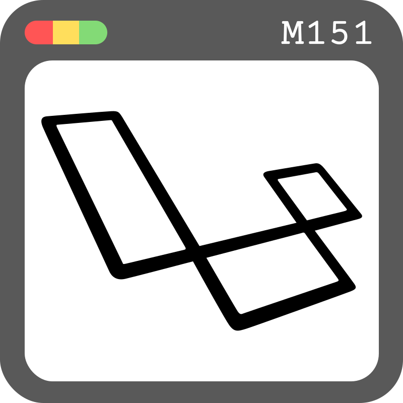

<p align="center">
   
</p>
<h1 align="center">
   M151 - Laravel
</h1>
<p align="center">
   Yannic Studer
</p>

## Documentation
Go to [documentation](./doc.md)

## Introduction
This is a Laravel project created for the purpose of learning the basics of the Laravel framework. The project is a continuation of the M151 repository, which includes the basic PHP. M151-Laravel is a GitHub repository containing a Laravel project that was used in class to learn the basics of the Laravel framework. This project is a continuation of the M151 repository, which includes basic PHP. The goal of this project is to create a simple event planner web application where users can create events, sign up for events, and view other users who have signed up for events.

## Getting Started:

> Optional:
> To get started with this project, you will need to have PHP and Composer installed on your computer. You can download PHP from the [official website](https://www.php.net/downloads) and Composer from the [official website](https://getcomposer.org/).

To get started with this project, you will need to have Laragon installed on your computer. You can download Laragon from the [official website](https://laragon.org/download/).

After you have installed Laragon, you can clone this repository to your local machine by clicking on the "Clone or download" button on the GitHub page and selecting "Open in Desktop" or "Download ZIP", or with console:

```
git clone https://github.com/FireNick44/M151-laravel.git
```

### Install dependencies
Next, you will need to install the project dependencies by running the following command from the project directory:

Execute in Laragon-Console, step for step:

0. Direct to the correct folder. Can change, depends on your `laragon/www/` folder

```
cd laravel
```

1. Install Composer

```
composer install
```

2. Navigate to the .env directory

```
cp .env.example .env
```

3. Generate an Artisan Key

```
php artisan key:generate
```

4. Start Laragon services, then execute this in the laragon console:

```
php artisan migrate:fresh
```

5. Seeder:

```
php artisan db:seed
```


## Functionality:

This project is a simple event planner web application. Users can create events, sign up for events, and view other users who have signed up for events.

### Contributors

 - [Yannic Studer](https://github.com/FireNick44)

 ## License
Project is [MIT licensed](./LICENSE)
